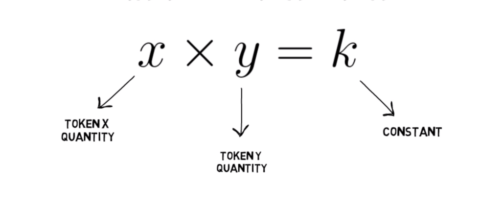

# Unipool 🦄 • [](https://github.com/abigger87/femplate/actions/workflows/tests.yml) [](https://github.com/abigger87/femplate/actions/workflows/lints.yml)   


## Getting Started

The idea here is simple, create an experimental AMM with more features at a lower gas cost. In my opinion, the largest barrier-to-entry for emerging AMMs is liquidity, or lack thereof. Due to the nature of constant product market makers, the less liquidity pools have the more slippage their users incur while trading. However, what if we could imitate deeper pools, without the underlying liquidity?


Well, we know  equals the constant product market curve where 
*  = token x reserves
*  = token y reserves
*  = constant/invariant

First observe that  for some real number  so we can rewrite  the constant product market curve as 


where  is the invariant of the constant product market curve. 

Suppose we want to target a specific constant  which directly allows us to control price impact on the pool. Observe again that we could let  for some real number  such that  for . By controlling the values of  and , we can construct any  for any $xy$ pool. Note that if , then we get the traditional constant product market curve. Working backwards from the above equation and replacing  with , we get


^2=c^2)


where  is now a different constant than the one we started with and 

 is called the target invariant. 


## Features

* ♻️Invariant imitation
* ✅Removed Uniswap LP fee
* ✅Added swap fee customization
* ✅Added ERC3156 Flash-loan support (to save gas)
* ✅Optional TWAP support (to save gas)


## Blueprint

```ml
lib
├─ ds-test — https://github.com/dapphub/ds-test
├─ solmate — https://github.com/Rari-Capital/solmate
src
├─ tests
│  └─ Unipool.t — "Unipool Tests"
└─ Unipool — "A Minimal Unipool Contract"
```

## License

[AGPL-3.0-only](https://github.com/abigger87/unipool/blob/master/LICENSE)

## Acknowledgements

- [foundry](https://github.com/gakonst/foundry)
- [solmate](https://github.com/Rari-Capital/solmate)
- [forge-std](https://github.com/brockelmore/forge-std)
- [foundry-toolchain](https://github.com/onbjerg/foundry-toolchain) by [onbjerg](https://github.com/onbjerg).

## Disclaimer

_These smart contracts are being provided as is. No guarantee, representation or warranty is being made, express or implied, as to the safety or correctness of the user interface or the smart contracts. They have not been audited and as such there can be no assurance they will work as intended, and users may experience delays, failures, errors, omissions, loss of transmitted information or loss of funds. The creators are not liable for any of the foregoing. Users should proceed with caution and use at their own risk._
